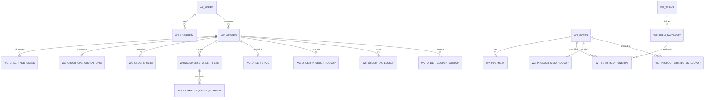

# Esquema de base de datos: WordPress 7.0 + WooCommerce 10.9.1

**Alcance:** instalación single-site estándar, prefijo `wp_`, WooCommerce Core, HPOS habilitado.  
**No incluido:** tablas creadas por plugins de terceros, el tema, pasarelas externas, Elementor, Yoast, WPML, etc.  
**Importante:** el prefijo real puede ser distinto de `wp_`.

---

## 1. Modelo general

WooCommerce no reemplaza el modelo de WordPress. Lo extiende:

- Los **productos**, **variaciones**, **cupones**, páginas, adjuntos y demás contenidos usan principalmente `wp_posts` y `wp_postmeta`.
- Las **categorías**, etiquetas, atributos globales y tipos de producto usan las tablas de términos de WordPress.
- Los **usuarios/clientes registrados** usan `wp_users` y `wp_usermeta`.
- Las **reseñas** y muchas notas históricas usan `wp_comments` y `wp_commentmeta`.
- Los **pedidos** usan HPOS (`wp_wc_orders` y tablas relacionadas) en instalaciones actuales.
- Los **ítems del pedido** siguen usando `wp_woocommerce_order_items` y `wp_woocommerce_order_itemmeta`.
- Las tablas `*_lookup` y `*_stats` son tablas derivadas para búsqueda, filtros, reportes y analítica.

WordPress y WooCommerce prácticamente no declaran claves foráneas SQL. Las relaciones son lógicas y se mantienen desde la aplicación.

---

# 2. WordPress Core — single site

## `wp_posts`

Almacena posts, páginas, productos, variaciones, cupones, adjuntos y otros Custom Post Types.

| Columna | Tipo | Uso |
|---|---|---|
| `ID` | bigint unsigned PK AI | Identificador |
| `post_author` | bigint unsigned | `wp_users.ID` lógico |
| `post_date` | datetime | Fecha local |
| `post_date_gmt` | datetime | Fecha GMT |
| `post_content` | longtext | Contenido/descripción |
| `post_title` | text | Título/nombre |
| `post_excerpt` | text | Extracto/descripción corta |
| `post_status` | varchar(20) | Estado |
| `comment_status` | varchar(20) | Comentarios |
| `ping_status` | varchar(20) | Pingbacks |
| `post_password` | varchar(255) | Contraseña |
| `post_name` | varchar(200) | Slug |
| `to_ping` | text | URLs por notificar |
| `pinged` | text | URLs notificadas |
| `post_modified` | datetime | Modificación local |
| `post_modified_gmt` | datetime | Modificación GMT |
| `post_content_filtered` | longtext | Contenido filtrado |
| `post_parent` | bigint unsigned | Padre lógico |
| `guid` | varchar(255) | GUID |
| `menu_order` | int | Orden |
| `post_type` | varchar(20) | Tipo de contenido |
| `post_mime_type` | varchar(100) | MIME, principalmente adjuntos |
| `comment_count` | bigint | Conteo |

Tipos WooCommerce frecuentes:

- `product`
- `product_variation`
- `shop_coupon`
- `shop_order` y `shop_order_refund` en almacenamiento legacy
- `attachment`

## `wp_postmeta`

Metadatos de cualquier fila de `wp_posts`.

| Columna | Tipo |
|---|---|
| `meta_id` | bigint unsigned PK AI |
| `post_id` | bigint unsigned |
| `meta_key` | varchar(255) |
| `meta_value` | longtext |

Metadatos frecuentes de producto:

- `_sku`
- `_regular_price`
- `_sale_price`
- `_price`
- `_stock`
- `_stock_status`
- `_manage_stock`
- `_backorders`
- `_weight`
- `_length`
- `_width`
- `_height`
- `_thumbnail_id`
- `_product_image_gallery`
- `_tax_status`
- `_tax_class`
- `_virtual`
- `_downloadable`
- `_downloadable_files`
- `_download_limit`
- `_download_expiry`
- `_sold_individually`
- `_purchase_note`
- `_featured`
- `_visibility` en instalaciones antiguas

## `wp_terms`

| Columna | Tipo |
|---|---|
| `term_id` | bigint unsigned PK AI |
| `name` | varchar(200) |
| `slug` | varchar(200) |
| `term_group` | bigint |

## `wp_term_taxonomy`

| Columna | Tipo |
|---|---|
| `term_taxonomy_id` | bigint unsigned PK AI |
| `term_id` | bigint unsigned |
| `taxonomy` | varchar(32) |
| `description` | longtext |
| `parent` | bigint unsigned |
| `count` | bigint |

Taxonomías WooCommerce frecuentes:

- `product_cat`
- `product_tag`
- `product_type`
- `product_visibility`
- `product_shipping_class`
- `pa_{atributo}`, por ejemplo `pa_color`

## `wp_term_relationships`

| Columna | Tipo |
|---|---|
| `object_id` | bigint unsigned, PK compuesto |
| `term_taxonomy_id` | bigint unsigned, PK compuesto |
| `term_order` | int |

Relación lógica:

```text
wp_posts.ID
  -> wp_term_relationships.object_id
  -> wp_term_taxonomy.term_taxonomy_id
  -> wp_terms.term_id
```

## `wp_termmeta`

| Columna | Tipo |
|---|---|
| `meta_id` | bigint unsigned PK AI |
| `term_id` | bigint unsigned |
| `meta_key` | varchar(255) |
| `meta_value` | longtext |

## `wp_users`

| Columna | Tipo |
|---|---|
| `ID` | bigint unsigned PK AI |
| `user_login` | varchar(60) |
| `user_pass` | varchar(255) |
| `user_nicename` | varchar(50) |
| `user_email` | varchar(100) |
| `user_url` | varchar(100) |
| `user_registered` | datetime |
| `user_activation_key` | varchar(255) |
| `user_status` | int |
| `display_name` | varchar(250) |

## `wp_usermeta`

| Columna | Tipo |
|---|---|
| `umeta_id` | bigint unsigned PK AI |
| `user_id` | bigint unsigned |
| `meta_key` | varchar(255) |
| `meta_value` | longtext |

WooCommerce guarda aquí datos persistentes del cliente, por ejemplo:

- `billing_first_name`
- `billing_last_name`
- `billing_company`
- `billing_address_1`
- `billing_address_2`
- `billing_city`
- `billing_state`
- `billing_postcode`
- `billing_country`
- `billing_email`
- `billing_phone`
- equivalentes `shipping_*`

## `wp_comments`

| Columna | Tipo |
|---|---|
| `comment_ID` | bigint unsigned PK AI |
| `comment_post_ID` | bigint unsigned |
| `comment_author` | tinytext |
| `comment_author_email` | varchar(100) |
| `comment_author_url` | varchar(200) |
| `comment_author_IP` | varchar(100) |
| `comment_date` | datetime |
| `comment_date_gmt` | datetime |
| `comment_content` | text |
| `comment_karma` | int |
| `comment_approved` | varchar(20) |
| `comment_agent` | varchar(255) |
| `comment_type` | varchar(20) |
| `comment_parent` | bigint unsigned |
| `user_id` | bigint unsigned |

Usos WooCommerce:

- reseñas de productos;
- notas de pedido en el modelo histórico/compatibilidad;
- comentarios normales.

## `wp_commentmeta`

| Columna | Tipo |
|---|---|
| `meta_id` | bigint unsigned PK AI |
| `comment_id` | bigint unsigned |
| `meta_key` | varchar(255) |
| `meta_value` | longtext |

Ejemplo: `rating`, `verified`.

## `wp_options`

| Columna | Tipo |
|---|---|
| `option_id` | bigint unsigned PK AI |
| `option_name` | varchar(191), UNIQUE |
| `option_value` | longtext |
| `autoload` | varchar(20) |

WooCommerce guarda aquí gran parte de su configuración con claves `woocommerce_*`, además de transients y estados de migración.

## `wp_links`

Tabla legacy de enlaces de WordPress. Sigue formando parte del esquema core aunque normalmente no es relevante para WooCommerce.

## Tablas adicionales en Multisite

- `wp_blogs`
- `wp_blogmeta`
- `wp_site`
- `wp_sitemeta`
- `wp_signups`
- `wp_registration_log`

Cada sitio de la red posee tablas con prefijo de blog, por ejemplo `wp_2_posts`, `wp_2_postmeta`, etc.

---

# 3. WooCommerce — catálogo y productos

## Fuente primaria de productos

### `wp_posts`

- Producto: `post_type = 'product'`
- Variación: `post_type = 'product_variation'`
- La variación apunta al producto padre mediante `post_parent`.

### `wp_postmeta`

Contiene SKU, precios, stock, dimensiones, impuestos, imágenes y configuración.

### Tablas de taxonomía

Categorías, etiquetas, clases de envío, tipos de producto, visibilidad y atributos globales.

## `wp_wc_product_meta_lookup`

Tabla derivada de búsqueda y filtrado rápido.

| Columna | Tipo |
|---|---|
| `product_id` | bigint PK |
| `sku` | varchar(100) |
| `global_unique_id` | varchar(100) |
| `virtual` | tinyint |
| `downloadable` | tinyint |
| `min_price` | decimal(19,4) |
| `max_price` | decimal(19,4) |
| `onsale` | tinyint |
| `stock_quantity` | double |
| `stock_status` | varchar(100) |
| `rating_count` | bigint |
| `average_rating` | decimal(3,2) |
| `total_sales` | bigint |
| `tax_status` | varchar(100) |
| `tax_class` | varchar(100) |

Relación: `product_id -> wp_posts.ID`.

No debe tratarse como fuente primaria. Puede regenerarse a partir de los objetos de producto.

## `wp_wc_product_attributes_lookup`

Tabla derivada para filtros por atributos.

| Columna | Tipo |
|---|---|
| `product_id` | bigint |
| `product_or_parent_id` | bigint |
| `taxonomy` | varchar(32) |
| `term_id` | bigint |
| `is_variation_attribute` | tinyint |
| `in_stock` | tinyint |

PK compuesta:

```text
(product_or_parent_id, term_id, product_id, taxonomy)
```

## `wp_woocommerce_attribute_taxonomies`

Define atributos globales registrados por WooCommerce.

| Columna | Tipo |
|---|---|
| `attribute_id` | bigint unsigned PK AI |
| `attribute_name` | varchar(200) |
| `attribute_label` | varchar(200) |
| `attribute_type` | varchar(20) |
| `attribute_orderby` | varchar(20) |
| `attribute_public` | int(1) |

Un atributo llamado `color` crea normalmente la taxonomía `pa_color`.

## Descargas de productos

### `wp_wc_product_download_directories`

| Columna | Tipo |
|---|---|
| `url_id` | bigint unsigned PK AI |
| `url` | varchar(256) |
| `enabled` | tinyint |

### `wp_woocommerce_downloadable_product_permissions`

| Columna | Tipo |
|---|---|
| `permission_id` | bigint unsigned PK AI |
| `download_id` | varchar(36) |
| `product_id` | bigint unsigned |
| `order_id` | bigint unsigned |
| `order_key` | varchar(200) |
| `user_email` | varchar(200) |
| `user_id` | bigint unsigned NULL |
| `downloads_remaining` | varchar(9) NULL |
| `access_granted` | datetime |
| `access_expires` | datetime NULL |
| `download_count` | bigint unsigned |

### `wp_wc_download_log`

| Columna | Tipo |
|---|---|
| `download_log_id` | bigint unsigned PK AI |
| `timestamp` | datetime |
| `permission_id` | bigint unsigned |
| `user_id` | bigint unsigned NULL |
| `user_ip_address` | varchar(100) |

---

# 4. Pedidos HPOS

HPOS usa cuatro tablas principales. Los ítems del pedido permanecen en las tablas `woocommerce_order_*`.

## `wp_wc_orders`

Cabecera del pedido, reembolso u otro tipo compatible.

| Columna | Tipo |
|---|---|
| `id` | bigint unsigned PK |
| `status` | varchar(20) NULL |
| `currency` | varchar(10) NULL |
| `type` | varchar(20) NULL |
| `tax_amount` | decimal(26,8) NULL |
| `total_amount` | decimal(26,8) NULL |
| `customer_id` | bigint unsigned NULL |
| `billing_email` | varchar(320) NULL |
| `date_created_gmt` | datetime NULL |
| `date_updated_gmt` | datetime NULL |
| `parent_order_id` | bigint unsigned NULL |
| `payment_method` | varchar(100) NULL |
| `payment_method_title` | text NULL |
| `transaction_id` | varchar(100) NULL |
| `ip_address` | varchar(100) NULL |
| `user_agent` | text NULL |
| `customer_note` | text NULL |

Relaciones lógicas:

- `customer_id -> wp_users.ID`
- `parent_order_id -> wp_wc_orders.id`
- `id -> wp_woocommerce_order_items.order_id`
- `id -> wp_wc_order_addresses.order_id`
- `id -> wp_wc_order_operational_data.order_id`
- `id -> wp_wc_orders_meta.order_id`

Tipos frecuentes:

- `shop_order`
- `shop_order_refund`

Estados frecuentes:

- `wc-pending`
- `wc-processing`
- `wc-on-hold`
- `wc-completed`
- `wc-cancelled`
- `wc-refunded`
- `wc-failed`
- `wc-checkout-draft`

## `wp_wc_order_addresses`

Una fila `billing` y otra `shipping` por pedido, cuando corresponda.

| Columna | Tipo |
|---|---|
| `id` | bigint unsigned PK AI |
| `order_id` | bigint unsigned |
| `address_type` | varchar(20) |
| `first_name` | text |
| `last_name` | text |
| `company` | text |
| `address_1` | text |
| `address_2` | text |
| `city` | text |
| `state` | text |
| `postcode` | text |
| `country` | text |
| `email` | varchar(320) |
| `phone` | varchar(100) |

Unique lógico/indexado: `(address_type, order_id)`.

## `wp_wc_order_operational_data`

Datos operativos separados de la cabecera comercial.

| Columna | Tipo |
|---|---|
| `id` | bigint unsigned PK AI |
| `order_id` | bigint unsigned UNIQUE |
| `created_via` | varchar(100) |
| `woocommerce_version` | varchar(20) |
| `prices_include_tax` | tinyint |
| `coupon_usages_are_counted` | tinyint |
| `download_permission_granted` | tinyint |
| `cart_hash` | varchar(100) |
| `new_order_email_sent` | tinyint |
| `order_key` | varchar(100) |
| `order_stock_reduced` | tinyint |
| `date_paid_gmt` | datetime |
| `date_completed_gmt` | datetime |
| `shipping_tax_amount` | decimal(26,8) |
| `shipping_total_amount` | decimal(26,8) |
| `discount_tax_amount` | decimal(26,8) |
| `discount_total_amount` | decimal(26,8) |
| `recorded_sales` | tinyint |

## `wp_wc_orders_meta`

Metadatos de pedido que no tienen columna dedicada.

| Columna | Tipo |
|---|---|
| `id` | bigint unsigned PK AI |
| `order_id` | bigint unsigned NULL |
| `meta_key` | varchar(255) |
| `meta_value` | text NULL |

## Compatibilidad HPOS/legacy

Cuando la sincronización de compatibilidad está habilitada, el mismo pedido puede existir también como:

```text
wp_posts.ID = wp_wc_orders.id
wp_posts.post_type = 'shop_order'
wp_postmeta.post_id = wp_wc_orders.id
```

No debe asumirse que `wp_posts` es la autoridad cuando HPOS está habilitado.

---

# 5. Ítems de pedido

## `wp_woocommerce_order_items`

| Columna | Tipo |
|---|---|
| `order_item_id` | bigint unsigned PK AI |
| `order_item_name` | text |
| `order_item_type` | varchar(200) |
| `order_id` | bigint unsigned |

Tipos frecuentes:

- `line_item`
- `shipping`
- `tax`
- `coupon`
- `fee`

## `wp_woocommerce_order_itemmeta`

| Columna | Tipo |
|---|---|
| `meta_id` | bigint unsigned PK AI |
| `order_item_id` | bigint unsigned |
| `meta_key` | varchar(255) |
| `meta_value` | longtext |

Metadatos frecuentes para `line_item`:

- `_product_id`
- `_variation_id`
- `_qty`
- `_tax_class`
- `_line_subtotal`
- `_line_subtotal_tax`
- `_line_total`
- `_line_tax`
- `_line_tax_data`

Relación:

```text
wp_wc_orders.id
  -> wp_woocommerce_order_items.order_id
  -> wp_woocommerce_order_itemmeta.order_item_id
```

---

# 6. Analítica y tablas lookup de pedidos

Estas tablas se derivan de pedidos e ítems y pueden reconstruirse mediante herramientas de WooCommerce.

## `wp_wc_order_stats`

| Columna | Tipo |
|---|---|
| `order_id` | bigint unsigned PK |
| `parent_id` | bigint unsigned |
| `date_created` | datetime |
| `date_created_gmt` | datetime |
| `date_paid` | datetime |
| `date_completed` | datetime |
| `num_items_sold` | int |
| `total_sales` | double |
| `tax_total` | double |
| `shipping_total` | double |
| `net_total` | double |
| `returning_customer` | tinyint NULL |
| `status` | varchar(20) |
| `customer_id` | bigint unsigned |
| `fulfillment_status` | varchar(50) NULL, condicional |

## `wp_wc_order_product_lookup`

| Columna | Tipo |
|---|---|
| `order_item_id` | bigint unsigned, PK compuesta |
| `order_id` | bigint unsigned, PK compuesta |
| `product_id` | bigint unsigned |
| `variation_id` | bigint unsigned |
| `customer_id` | bigint unsigned NULL |
| `date_created` | datetime |
| `product_qty` | int |
| `product_net_revenue` | double |
| `product_gross_revenue` | double |
| `coupon_amount` | double |
| `tax_amount` | double |
| `shipping_amount` | double |
| `shipping_tax_amount` | double |

## `wp_wc_order_tax_lookup`

| Columna | Tipo |
|---|---|
| `order_id` | bigint unsigned, PK compuesta |
| `tax_rate_id` | bigint unsigned, PK compuesta |
| `date_created` | datetime |
| `shipping_tax` | double |
| `order_tax` | double |
| `total_tax` | double |

## `wp_wc_order_coupon_lookup`

| Columna | Tipo |
|---|---|
| `order_id` | bigint unsigned, PK compuesta |
| `coupon_id` | bigint, PK compuesta |
| `date_created` | datetime |
| `discount_amount` | double |

## `wp_wc_customer_lookup`

| Columna | Tipo |
|---|---|
| `customer_id` | bigint unsigned PK AI |
| `user_id` | bigint unsigned UNIQUE NULL |
| `username` | varchar(60) |
| `first_name` | varchar(255) |
| `last_name` | varchar(255) |
| `email` | varchar(100) NULL |
| `date_last_active` | timestamp NULL |
| `date_registered` | timestamp NULL |
| `country` | char(2) |
| `postcode` | varchar(20) |
| `city` | varchar(100) |
| `state` | varchar(100) |

`customer_id` es un identificador analítico de WooCommerce. No siempre coincide con `wp_users.ID`.

## `wp_wc_category_lookup`

| Columna | Tipo |
|---|---|
| `category_tree_id` | bigint unsigned, PK compuesta |
| `category_id` | bigint unsigned, PK compuesta |

---

# 7. Inventario, sesiones y limitación

## `wp_wc_reserved_stock`

Reserva temporal de stock durante checkout.

| Columna | Tipo |
|---|---|
| `order_id` | bigint, PK compuesta |
| `product_id` | bigint, PK compuesta |
| `stock_quantity` | double |
| `timestamp` | datetime |
| `expires` | datetime |

## `wp_woocommerce_sessions`

| Columna | Tipo |
|---|---|
| `session_id` | bigint unsigned PK AI |
| `session_key` | char(32) UNIQUE |
| `session_value` | longtext |
| `session_expiry` | bigint unsigned |

## `wp_wc_rate_limits`

| Columna | Tipo |
|---|---|
| `rate_limit_id` | bigint unsigned PK AI |
| `rate_limit_key` | varchar(200) UNIQUE |
| `rate_limit_expiry` | bigint unsigned |
| `rate_limit_remaining` | smallint |

---

# 8. Impuestos

## `wp_woocommerce_tax_rates`

| Columna | Tipo |
|---|---|
| `tax_rate_id` | bigint unsigned PK AI |
| `tax_rate_country` | varchar(2) |
| `tax_rate_state` | varchar(200) |
| `tax_rate` | varchar(8) |
| `tax_rate_name` | varchar(200) |
| `tax_rate_priority` | bigint unsigned |
| `tax_rate_compound` | int(1) |
| `tax_rate_shipping` | int(1) |
| `tax_rate_order` | bigint unsigned |
| `tax_rate_class` | varchar(200) |

## `wp_woocommerce_tax_rate_locations`

| Columna | Tipo |
|---|---|
| `location_id` | bigint unsigned PK AI |
| `location_code` | varchar(200) |
| `tax_rate_id` | bigint unsigned |
| `location_type` | varchar(40) |

## `wp_wc_tax_rate_classes`

| Columna | Tipo |
|---|---|
| `tax_rate_class_id` | bigint unsigned PK AI |
| `name` | varchar(200) |
| `slug` | varchar(200) UNIQUE |

---

# 9. Envíos

## `wp_woocommerce_shipping_zones`

| Columna | Tipo |
|---|---|
| `zone_id` | bigint unsigned PK AI |
| `zone_name` | varchar(200) |
| `zone_order` | bigint unsigned |

## `wp_woocommerce_shipping_zone_locations`

| Columna | Tipo |
|---|---|
| `location_id` | bigint unsigned PK AI |
| `zone_id` | bigint unsigned |
| `location_code` | varchar(200) |
| `location_type` | varchar(40) |

## `wp_woocommerce_shipping_zone_methods`

| Columna | Tipo |
|---|---|
| `zone_id` | bigint unsigned |
| `instance_id` | bigint unsigned PK AI |
| `method_id` | varchar(200) |
| `method_order` | bigint unsigned |
| `is_enabled` | tinyint |

La configuración específica de cada instancia de método suele almacenarse en `wp_options`.

---

# 10. Pagos, API y webhooks

## `wp_woocommerce_payment_tokens`

| Columna | Tipo |
|---|---|
| `token_id` | bigint unsigned PK AI |
| `gateway_id` | varchar(200) |
| `token` | text |
| `user_id` | bigint unsigned |
| `type` | varchar(200) |
| `is_default` | tinyint |

## `wp_woocommerce_payment_tokenmeta`

| Columna | Tipo |
|---|---|
| `meta_id` | bigint unsigned PK AI |
| `payment_token_id` | bigint unsigned |
| `meta_key` | varchar(255) |
| `meta_value` | longtext |

## `wp_woocommerce_api_keys`

| Columna | Tipo |
|---|---|
| `key_id` | bigint unsigned PK AI |
| `user_id` | bigint unsigned |
| `description` | varchar(200) NULL |
| `permissions` | varchar(10) |
| `consumer_key` | char(64) |
| `consumer_secret` | char(43) |
| `nonces` | longtext NULL |
| `truncated_key` | char(7) |
| `last_access` | datetime NULL |

## `wp_wc_webhooks`

| Columna | Tipo |
|---|---|
| `webhook_id` | bigint unsigned PK AI |
| `status` | varchar(200) |
| `name` | text |
| `user_id` | bigint unsigned |
| `delivery_url` | text |
| `secret` | text |
| `topic` | varchar(200) |
| `date_created` | datetime |
| `date_created_gmt` | datetime |
| `date_modified` | datetime |
| `date_modified_gmt` | datetime |
| `api_version` | smallint |
| `failure_count` | smallint |
| `pending_delivery` | tinyint |

---

# 11. Logs y administración

## `wp_woocommerce_log`

| Columna | Tipo |
|---|---|
| `log_id` | bigint unsigned PK AI |
| `timestamp` | datetime |
| `level` | smallint |
| `source` | varchar(200) |
| `message` | longtext |
| `context` | longtext NULL |

## `wp_wc_admin_notes`

Tabla de notas de WooCommerce Admin.

Columnas principales:

```text
note_id, name, type, locale, title, content, content_data,
status, source, date_created, date_reminder, is_snoozable,
layout, image, is_deleted, is_read, icon
```

## `wp_wc_admin_note_actions`

```text
action_id, note_id, name, label, query, status,
actioned_text, nonce_action, nonce_name
```

---

# 12. Funciones opcionales recientes de WooCommerce

La existencia y estructura exacta de estas tablas depende de las funciones activadas y de la ruta de actualización:

- `wp_wc_stock_notifications`
- `wp_wc_stock_notificationmeta`
- `wp_wc_order_fulfillments`
- `wp_wc_order_fulfillment_meta`

No deben asumirse en todas las tiendas. Deben detectarse en `information_schema.tables`.

---

# 13. Action Scheduler

WooCommerce incluye Action Scheduler para trabajos en segundo plano. Normalmente aparecen:

- `wp_actionscheduler_actions`
- `wp_actionscheduler_claims`
- `wp_actionscheduler_groups`
- `wp_actionscheduler_logs`

Estas tablas gestionan colas, reintentos, tareas programadas, sincronizaciones y procesos de mantenimiento.

---

# 14. Diagrama lógico resumido



---

# 15. Consultas de referencia

## Producto con precio, SKU y stock

```sql
SELECT
    p.ID,
    p.post_title,
    p.post_status,
    l.sku,
    l.min_price,
    l.max_price,
    l.stock_quantity,
    l.stock_status
FROM wp_posts p
LEFT JOIN wp_wc_product_meta_lookup l
       ON l.product_id = p.ID
WHERE p.post_type IN ('product', 'product_variation');
```

## Pedido HPOS con direcciones

```sql
SELECT
    o.id,
    o.status,
    o.currency,
    o.total_amount,
    o.customer_id,
    o.billing_email,
    o.date_created_gmt,
    b.first_name AS billing_first_name,
    b.last_name  AS billing_last_name,
    s.first_name AS shipping_first_name,
    s.last_name  AS shipping_last_name
FROM wp_wc_orders o
LEFT JOIN wp_wc_order_addresses b
       ON b.order_id = o.id
      AND b.address_type = 'billing'
LEFT JOIN wp_wc_order_addresses s
       ON s.order_id = o.id
      AND s.address_type = 'shipping'
WHERE o.type = 'shop_order';
```

## Detalle de líneas de pedido

```sql
SELECT
    oi.order_id,
    oi.order_item_id,
    oi.order_item_name,
    MAX(CASE WHEN oim.meta_key = '_product_id'
             THEN oim.meta_value END) AS product_id,
    MAX(CASE WHEN oim.meta_key = '_variation_id'
             THEN oim.meta_value END) AS variation_id,
    MAX(CASE WHEN oim.meta_key = '_qty'
             THEN oim.meta_value END) AS quantity,
    MAX(CASE WHEN oim.meta_key = '_line_total'
             THEN oim.meta_value END) AS line_total
FROM wp_woocommerce_order_items oi
LEFT JOIN wp_woocommerce_order_itemmeta oim
       ON oim.order_item_id = oi.order_item_id
WHERE oi.order_item_type = 'line_item'
GROUP BY
    oi.order_id,
    oi.order_item_id,
    oi.order_item_name;
```

## Categorías de producto

```sql
SELECT
    p.ID AS product_id,
    p.post_title,
    t.term_id,
    t.name AS category_name,
    t.slug AS category_slug
FROM wp_posts p
JOIN wp_term_relationships tr
  ON tr.object_id = p.ID
JOIN wp_term_taxonomy tt
  ON tt.term_taxonomy_id = tr.term_taxonomy_id
 AND tt.taxonomy = 'product_cat'
JOIN wp_terms t
  ON t.term_id = tt.term_id
WHERE p.post_type = 'product';
```

---

# 16. Reglas de implementación

1. No escribir productos directamente con `INSERT/UPDATE` salvo procesos de migración totalmente controlados.
2. Usar CRUD de WooCommerce: `wc_get_product()`, `WC_Product`, `wc_get_order()`, `WC_Order`.
3. No considerar las tablas `lookup` como fuente primaria.
4. Después de una carga SQL directa, regenerar índices/lookup y limpiar cachés.
5. Detectar HPOS antes de consultar pedidos.
6. No asumir que el prefijo es `wp_`.
7. No añadir claves foráneas a tablas core sin evaluar el ciclo de actualización de WordPress/WooCommerce.
8. Para integraciones externas, preferir REST API, Store API o una capa de servicio propia.

---

# 17. Cómo obtener el DDL exacto de una tienda real

El esquema real cambia por plugins, funciones experimentales, versión, prefijo y migraciones históricas.

```bash
mysqldump \
  --host=HOST \
  --user=USER \
  --password \
  --no-data \
  --routines \
  --triggers \
  --events \
  DATABASE_NAME > wordpress-woocommerce-schema.sql
```

Para listar tablas desde WP-CLI:

```bash
wp db tables --all-tables-with-prefix
```

Para verificar HPOS desde SQL:

```sql
SELECT option_name, option_value
FROM wp_options
WHERE option_name IN (
  'woocommerce_custom_orders_table_enabled',
  'woocommerce_custom_orders_table_data_sync_enabled'
);
```

Para conocer las versiones:

```sql
SELECT option_name, option_value
FROM wp_options
WHERE option_name IN (
  'woocommerce_version',
  'woocommerce_db_version',
  'db_version'
);
```

